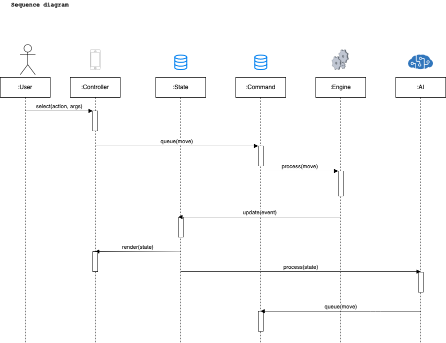
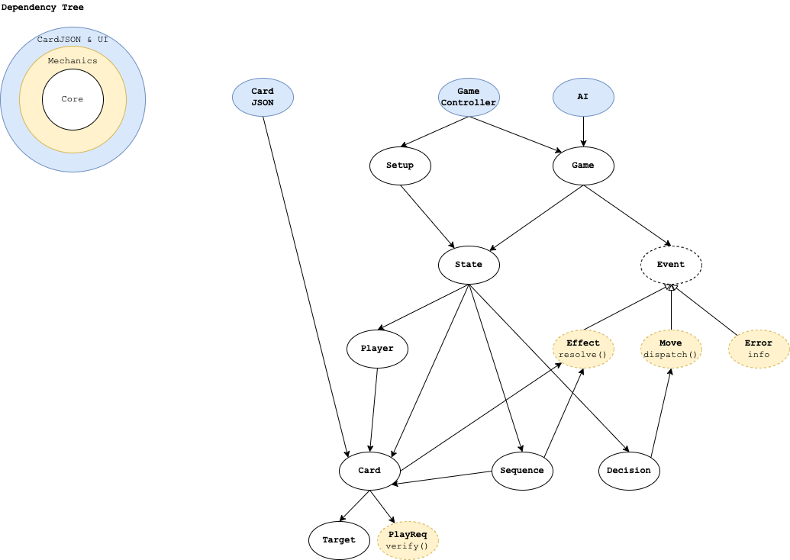
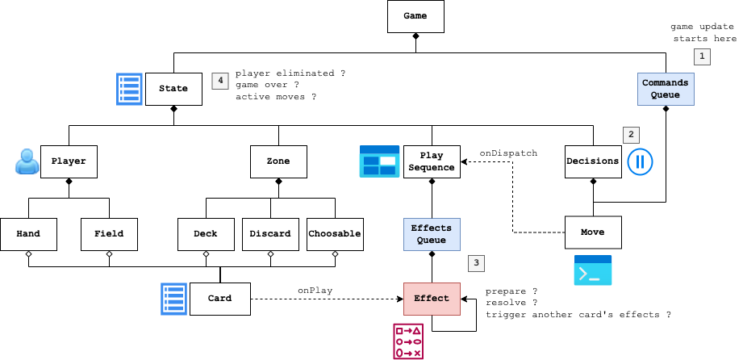

# WildWestOnline

Prototyping a game engine for the [Bang!](<https://en.wikipedia.org/wiki/Bang!_(card_game)>) card game.

### Features

- [x] Engine is open source
- [ ] Powerful scripting language using JSON 
- [ ] Support classic Bang! and extensions
- [ ] Any can play online

## Terminology
- Engine: game interface
- Queue: events queue
- State: bunch of data describing game state
- Card: card abilities as data
- Effect: any change in the game state, applied with argument
- Move: any action taken by the player
- Sequence: what begins when a Player Action is taken
- Option: a choice that have to be made by player when resolving sequence

## Effect solving

- Effect solving uses graph structure
- Effect may be blocked waiting user input. => show options through state

## Architecture

### Sequence

### Layers

### Game objects

