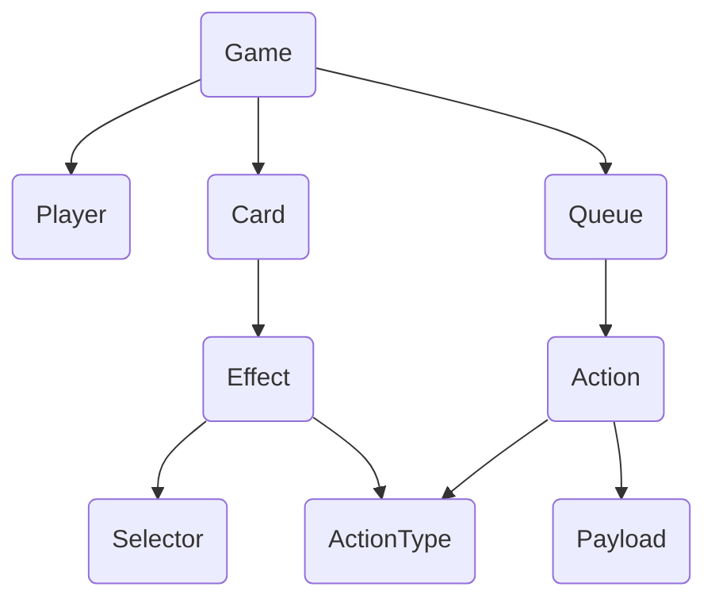
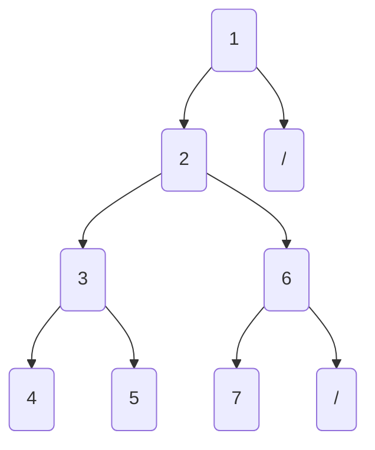
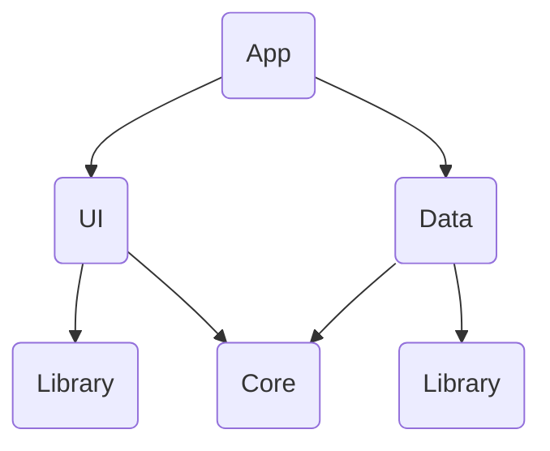
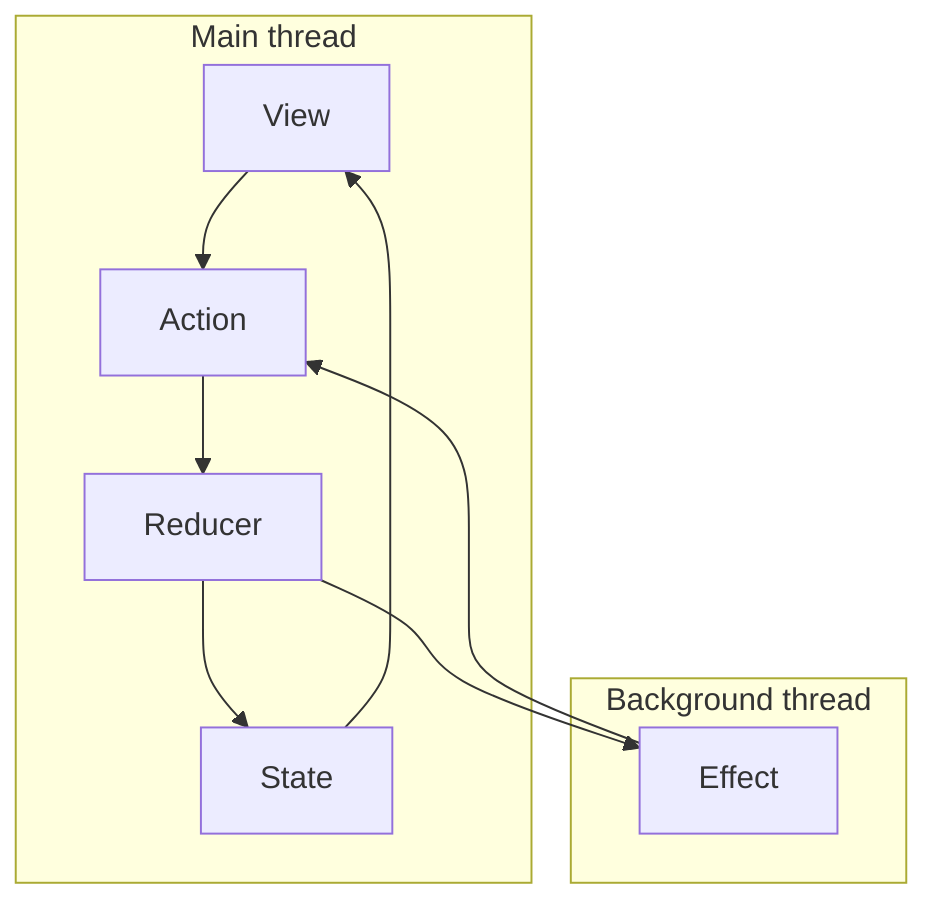
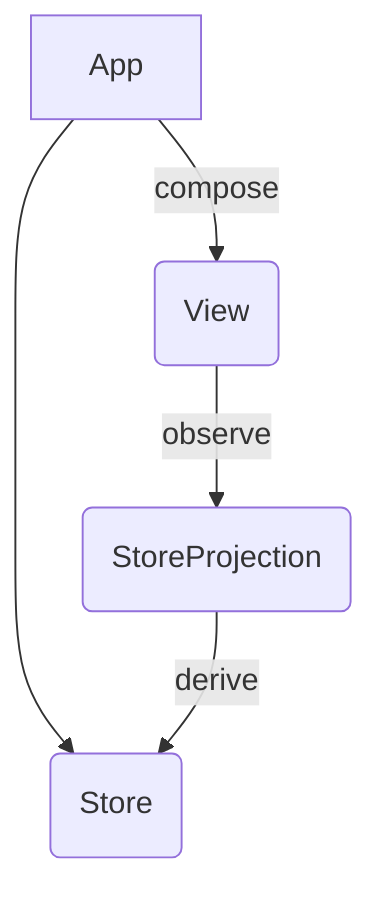
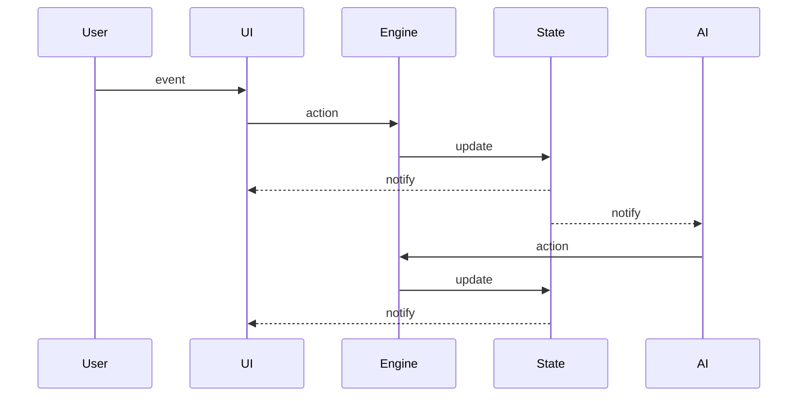

# WildWestOnline

**Prototyping a game engine for the [Bang!](<https://en.wikipedia.org/wiki/Bang!_(card_game)>) card game**

**Trading card games**: a form of competitive activity played according to rules. It is turn based, cards have properties and have rules.
Currently, there is no effective way to prototype trading card games and then be able to test the workings and the implications of rules in these games. 

**DSL**: Domain Specific Languages are computer languages designed for a specific domain. 
Since DSLs result in programs that are smaller and easier to understand, they allow even non-programmers to read, write and understand the language.

### Key Features

- [x] Game DSL
- [x] Serializable game object
- [x] Composable rules
- [x] Support classic Bang!
- [ ] Support extensions
- [ ] Replay
- [ ] Multiplayer online

### MetaModel

- **Game**: Global metaclass which contains all elements in a game.
- **Player**: Players who are participating in a game.
- **Card**: Cards that are used in a game. Cards can have multiple properties, define additional rules, have actions that can be played and have side effects that happen when they are being played.
- **Action**: Any action changing the game state. It can be performed by the user or by the system.
- **Effect**: Action applied when playing a card. An Effect may be resolved as a sequence of actions
- **Selector**: Selectors are used to specify which objects an effect should affect.

### Event solving

- The process of resolving an event is similar to a depth-first search using a graph 
- Some effects may be blocked while waiting for user input. Then options are displayed through state.

### Modular Architecture

The project consists of Swift Package products with the following structure.
- All features are implemented in self-contained module `Core`
- `UI` and `Data` layers depend on `Core`

### Redux

Redux architecture is meant to protect changes in an application’s state. It forces you to define clearly what state should be set when a specific action is dispatched.

- There is a single global state kept in store.
- State is immutable.
- New state can be set only by dispatching an action to store.
- New state can be calculated only by reducer which is a pure function.
- Store notifies subscribers by broadcasting a new state.
- Each side-effect is implemented as an asynchronous action.

#### Store projection
The app should have a single real Store, holding a single source-of-truth. 
However, we can "derive" this store to small subsets, called store projections, that will handle a smaller part of the state for each Screen. So we can map back-and-forth to the original store types.

### Sequence diagram

Online gameplay uses shared database

